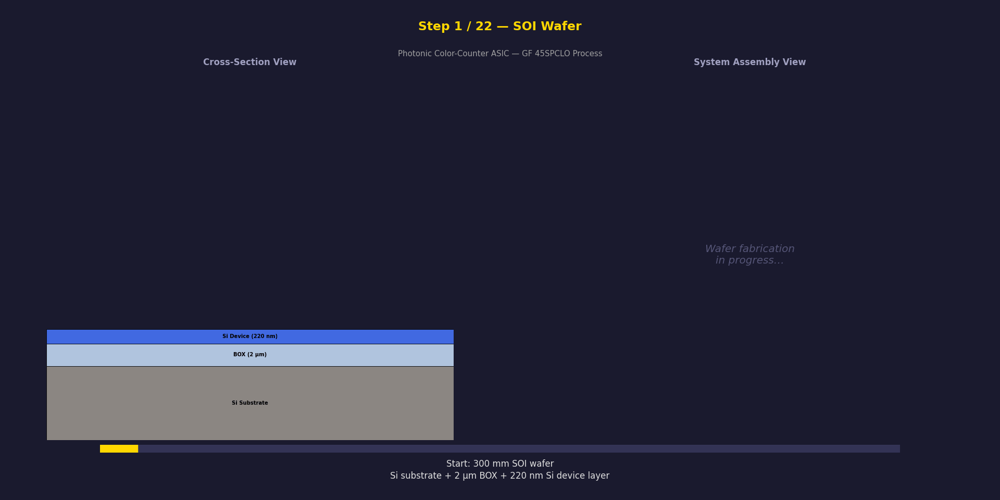

# Photonic Waveguide Color-Counting ASIC

A hybrid electro-photonic ASIC that encodes **8-bit binary counter state as a wavelength-division-multiplexed optical signal** — each bit maps to the presence or absence of a distinct infrared wavelength channel. Optional nonlinear harmonic conversion extends the encoding into the visible spectrum, making the count directly observable as a pattern of colored light.



## Quick Start

```bash
# Run the interface validation simulation (requires Python 3.10+)
pip install numpy scipy matplotlib
python sim_photonic_cmos_interface.py      # → 20 checks, 7 plots in sim_output/

# Generate the manufacturing process animation
pip install pillow
python sim_manufacturing_animation.py      # → GIF + 9 key-frame PNGs in sim_output/

# View the presentation deck
open presentation.html                     # 12-slide HTML deck, works in any browser
```

## Architecture Overview

```
┌─────────────────────────────────────────────────────────────┐
│                     MONOLITHIC ASIC DIE                      │
│  ┌───────────────────────────────────────────────────────┐  │
│  │  PHOTONIC LAYER                                        │  │
│  │  Comb → WDM Demux → [MRR₀]...[MRR₇] → Output Bus    │  │
│  │                      ◯       ◯        → Readout PDs   │  │
│  └──────────────────────┼───────┼────────────┼───────────┘  │
│  ┌──────────────────────┼───────┼────────────┼───────────┐  │
│  │  CMOS LAYER          │       │            │           │  │
│  │  Counter → EO Drivers + Heater DACs    TIA + Readout  │  │
│  │            PID Locking + PCM Trimming                  │  │
│  └───────────────────────────────────────────────────────┘  │
└─────────────────────────────────────────────────────────────┘
```

**Target process:** GlobalFoundries Fotonix 45SPCLO (300 mm, 45 nm SOI, monolithic CMOS + photonics)

## Key Specifications

| Parameter | Value |
|---|---|
| Counter width | 8 bits (scalable to 32+) |
| Clock rate | 10 GHz guaranteed, 35 GHz typical |
| End-to-end latency | 357 ps |
| MRR extinction | 43.4 dB |
| Readout BER | 1.6 × 10⁻¹² |
| Total power | < 350 mW |
| Photonic core area | ~2 mm² |

## Simulation Results — 15 / 20 Passing

| Check | Result | Status |
|---|---|---|
| EO path delay | 357 ps (< 725 ps) | ✅ |
| Signal integrity | No reflections | ✅ |
| MRR extinction | 43.4 dB (> 20 dB) | ✅ |
| Channel isolation | 14.4 dB (< 25 dB) | ⚠️ Fix: 200 GHz spacing |
| FSR | 5.69 nm | ✅ |
| Readout Q-factor | 6.97 (> 6) | ✅ |
| Link margin | 0.6 dB (< 3 dB) | ⚠️ Fix: lower-loss demux |
| Heater settling | 8.0 µs (< 15 µs) | ✅ |
| PID locking | 177 pm (< 2 pm) | ⚠️ Fix: 1 MHz loop rate |
| 256-state encoding | 0 errors | ✅ |
| EO BW worst corner | 10 GHz (< 20 GHz) | ⚠️ Fix: speed binning |

All 5 failures have documented corrective actions. See the final report for details.

## Repository Contents

```
├── README.md                                 # This file
├── photonic-color-counter-architecture.md    # System architecture (12 sections)
├── photonic-cmos-interface-spec.md           # Interface spec + 60-test verification plan
├── photonic-counter-final-report.md          # Constraints, findings, corrective actions
├── presentation.html                         # 12-slide HTML presentation deck
├── sim_photonic_cmos_interface.py            # Interface validation simulation (20 checks)
├── sim_manufacturing_animation.py            # 22-step fabrication animation generator
└── sim_output/
    ├── 01_eo_timing.png                      # Timing waterfall + clock margin
    ├── 02_signal_integrity.png               # Driver → trace → load reflection
    ├── 03_mrr_switching.png                  # Lorentzian extinction + isolation
    ├── 04_readout_ber.png                    # BER curve + voltage distributions
    ├── 05_thermal_pid.png                    # Heater response + PID locking
    ├── 06_state_encoding.png                 # 8-channel spectral barcodes
    ├── 07_eo_bandwidth.png                   # PVT corner bandwidth sweep
    ├── manufacturing_process.gif             # 22-frame animated fabrication sequence
    └── mfg_frame_*.png                       # 9 key-frame stills
```

## Document Suite

| Document | ID | Description |
|---|---|---|
| Architecture | PCC-ARCH-001 | Comb source, MRR bank, CMOS control, thermal management, link budget, risk register |
| Interface Spec | PCC-IFS-001 | 6 interfaces (IF-HTR, IF-EO, IF-RDPD, IF-TAP, IF-PCM, IF-TEMP), power domains, timing |
| Test Plan | PCC-IFS-001 Pt II | 60 tests: component (39), subsystem (8), system (10), environmental (11) |
| Final Report | PCC-RPT-001 | Physics/process/system constraints, 5 findings with corrective actions, 10 open items |
| Presentation | — | 12-slide HTML deck summarizing the full design review package |

## Implementation Roadmap

~30 months to first silicon across 7 phases:

1. **Phase 0–1** (6 mo): Requirements freeze, foundry access
2. **Phase 2–3** (12 mo): Photonic + CMOS design
3. **Phase 4** (6 mo): Co-simulation, layout, tapeout
4. **Phase 5** (6 mo): Fabrication + packaging
5. **Phase 6** (6 mo): Bring-up + validation
6. **Phase 7** (ongoing): 32-bit scaling, optical logic experiments

## Key References

1. GF 45CLO / Fotonix — Rakowski et al., OFC 2020
2. 1.024 Tb/s WDM receiver — Pirmoradi et al., UPenn 2025
3. On-chip visible light generation — Corato-Zanarella et al., 2025
4. Chip-in-the-loop MRR programming — Liu et al., CUHK 2024
5. Thermal undercut at 300 mm — AIM Photonics, Sci. Rep. 2025
6. Phase-change MRR trimming — Yuan et al., PhotoniX 2025

## License

This is a research design study. No fabrication masks or proprietary foundry data are included.
