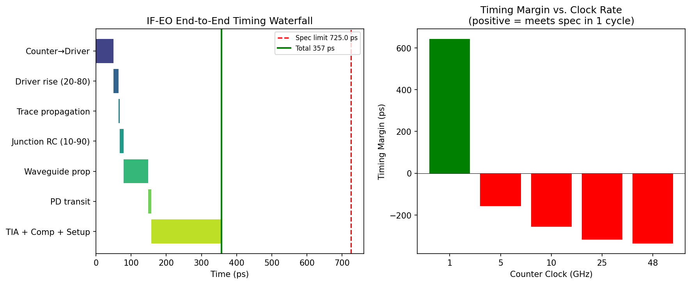
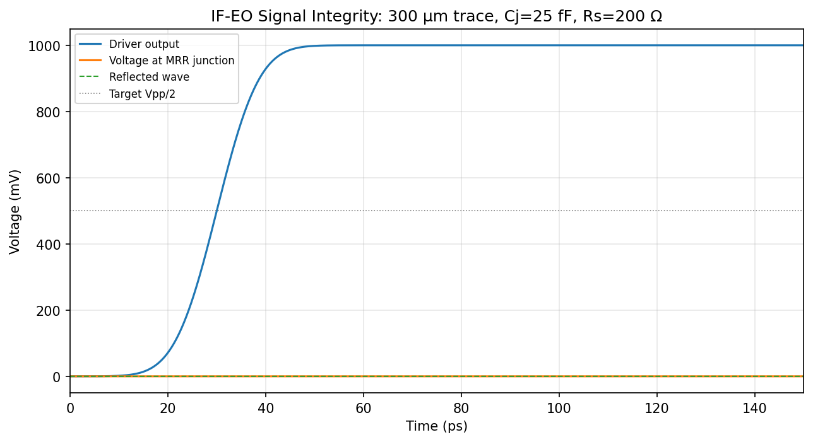
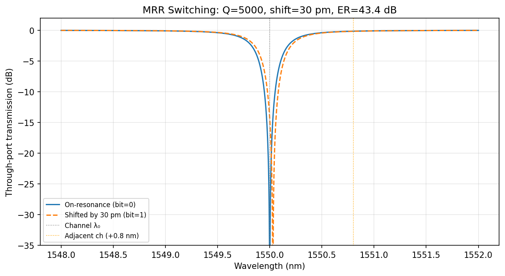
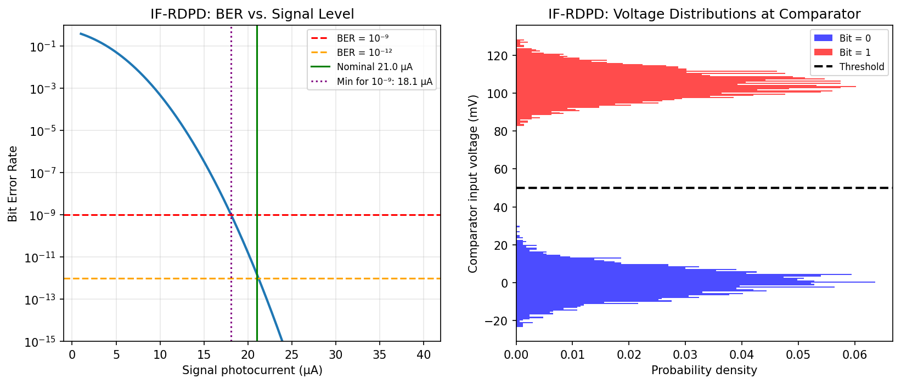
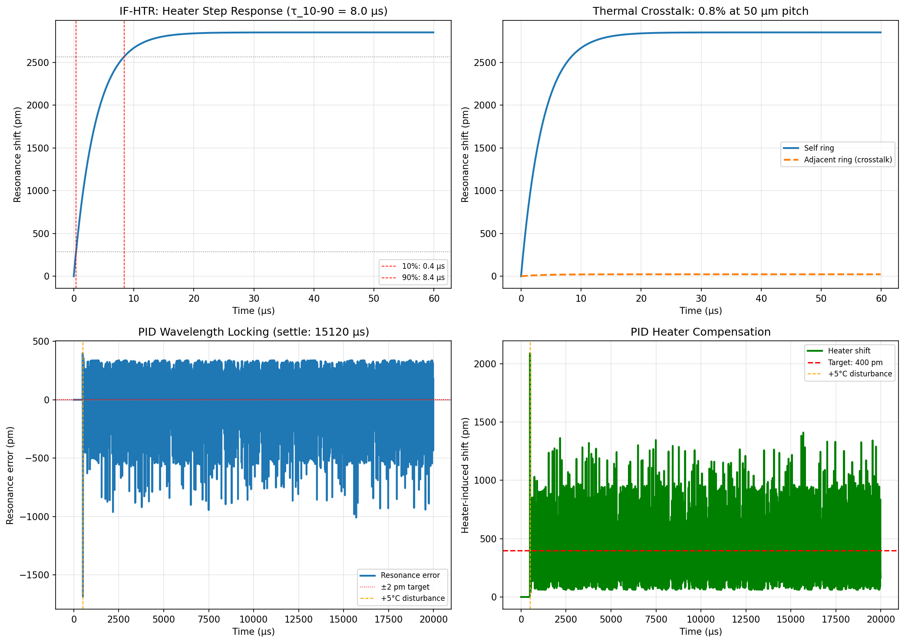
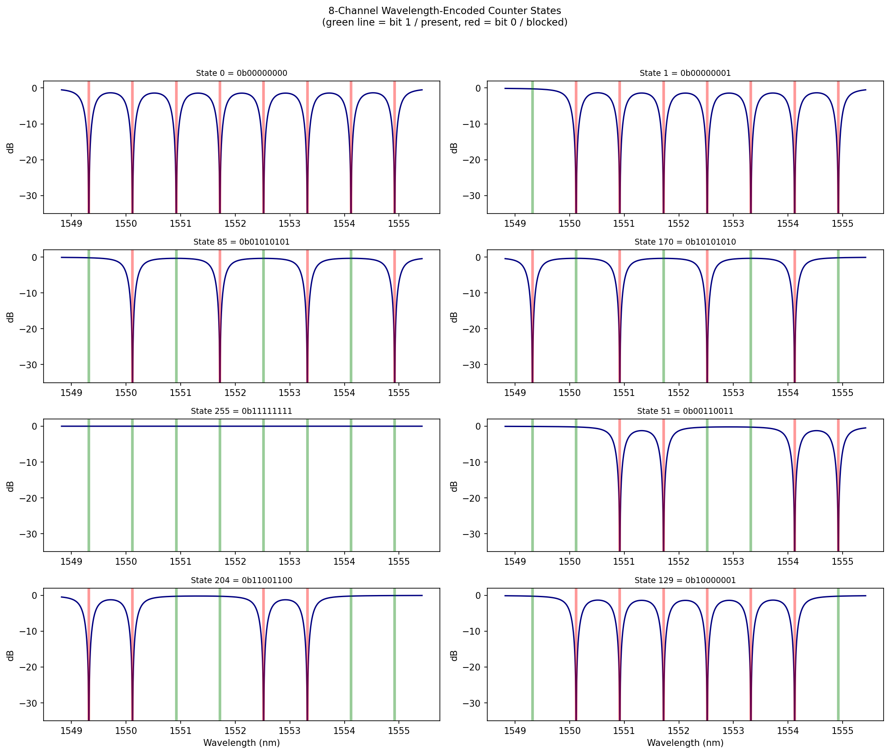
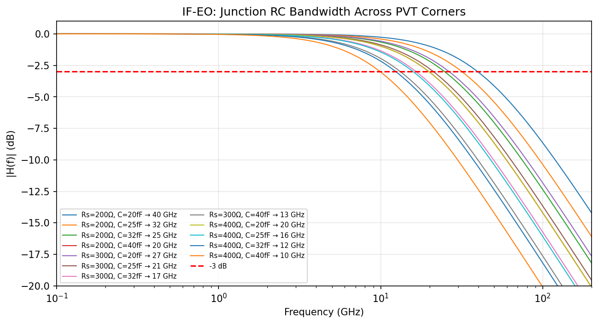

# Photonic Waveguide Color-Counting ASIC

A hybrid electro-photonic ASIC that encodes **8-bit binary counter state as a wavelength-division-multiplexed optical signal**. Each counter bit maps to the presence or absence of a distinct infrared wavelength channel on a shared waveguide bus. The collective spectrum — the "color pattern" — changes with every count.


> **Status:** Pre-silicon design complete. Design review package ready. ~30 months to first silicon.
>
> **Process:** GlobalFoundries Fotonix 45SPCLO · 300 mm · 45 nm SOI · Monolithic CMOS + Photonics

---

## 📋 Start Here

| What you want | Where to go |
|---|---|
| Full project summary with all results | [**FINAL-SUMMARY.md**](FINAL-SUMMARY.md) |
| Design review slide deck | [**presentation.html**](presentation.html) (open in browser) |
| How the chip is made (video) | [**manufacturing_process.mp4**](sim_output/manufacturing_process.mp4) |
| Simulation results walkthrough (video) | [**simulation_results.mp4**](sim_output/simulation_results.mp4) |
| Live counter operation demo (video) | [**counter_operation.mp4**](sim_output/counter_operation.mp4) |
| Formal project closure | [**PROJECT-CLOSURE-REPORT.md**](PROJECT-CLOSURE-REPORT.md) |

---

## 🎬 Video Documentation

Three standalone 1920×1080 H.264 MP4 files — playable in any browser or media player.

| Video | Duration | Content |
|---|---|---|
| [**manufacturing_process.mp4**](sim_output/manufacturing_process.mp4) | 44 s | 22-step dual-panel animation: wafer cross-section builds layer-by-layer (left) while system assembly progresses (right). Covers SOI wafer → waveguide etch → PN implant → Ge PD → SiN → BEOL metals → thermal undercut → PCM → packaging. |
| [**simulation_results.mp4**](sim_output/simulation_results.mp4) | 46 s | 20 interface checks revealed one-by-one with live pass/fail bar, followed by score summary, key margins, and 5 findings with corrective actions. |
| [**counter_operation.mp4**](sim_output/counter_operation.mp4) | 35 s | Counter cycles 0→63 with synchronized spectral output (Lorentzian through-port), 8-bit register display, and MRR switch-bank diagram showing PASS/DROP per ring. |

---

## 🏗️ Architecture

```
┌─────────────────────────────────────────────────────────────┐
│                     MONOLITHIC ASIC DIE                      │
│  ┌───────────────────────────────────────────────────────┐  │
│  │  PHOTONIC LAYER                                        │  │
│  │  Comb → WDM Demux → [MRR₀]...[MRR₇] → Output Bus    │  │
│  │                      ◯       ◯        → Readout PDs   │  │
│  └──────────────────────┼───────┼────────────┼───────────┘  │
│  ┌──────────────────────┼───────┼────────────┼───────────┐  │
│  │  CMOS LAYER          │       │            │           │  │
│  │  Counter → EO Drivers + Heater DACs    TIA + Readout  │  │
│  │            PID Locking + PCM Trimming                  │  │
│  └───────────────────────────────────────────────────────┘  │
└─────────────────────────────────────────────────────────────┘
```

CMOS performs counting and closed-loop control. Photonics provides wavelength-parallel state encoding and readout. See [Architecture Document](photonic-color-counter-architecture.md) for full details.

---

## 📊 Key Specifications

| Parameter | Value |
|---|---|
| Counter width | 8 bits (scalable to 32+) |
| Clock rate | 10 GHz guaranteed · 35 GHz typical |
| End-to-end latency | 357 ps |
| MRR switching extinction | 43.4 dB |
| MRR free spectral range | 5.69 nm |
| Channel spacing | 200 GHz (1.6 nm) recommended |
| Readout BER | 1.6 × 10⁻¹² |
| Heater efficiency | 4.3 mW/π (with thermal undercut) |
| Total power | < 350 mW |
| Photonic core area | ~2 mm² |

---

## ✅ Simulation Results — 15 / 20 Passing

| Check | Result | Status |
|---|---|---|
| EO path delay | 357 ps (< 725 ps) | ✅ 51% margin |
| Signal integrity | ~0% reflection | ✅ |
| MRR extinction | 43.4 dB (> 20 dB) | ✅ +23 dB margin |
| Channel isolation | 14.4 dB (> 25 dB) | ⚠️ Fix: 200 GHz spacing |
| Readout BER | 1.6×10⁻¹² (< 10⁻⁹) | ✅ 3-decade margin |
| Link margin | 0.6 dB (> 3 dB) | ⚠️ Fix: lower-loss demux |
| Heater settling | 8.0 µs (< 15 µs) | ✅ 47% margin |
| PID locking | 177 pm (< 2 pm) | ⚠️ Fix: 1 MHz loop rate |
| 256-state encoding | 0 errors | ✅ All states correct |
| EO BW worst corner | 10 GHz (> 20 GHz) | ⚠️ Fix: speed binning |

All 5 failures have documented corrective actions. See the [Final Report](photonic-counter-final-report.md) for root causes and fixes.

---

## 🔬 Simulation Plots

| Plot | Description |
|---|---|
|  | **EO Timing Waterfall** — stage-by-stage delay + margin vs. clock rate |
|  | **Signal Integrity** — driver, load voltage, and reflected wave |
|  | **MRR Switching** — Lorentzian through-port for on/off resonance |
|  | **Readout BER** — BER vs. photocurrent + comparator voltage distributions |
|  | **Thermal + PID** — heater step response, crosstalk, PID locking transient |
|  | **State Encoding** — spectral barcodes for 8 representative counter states |
|  | **EO Bandwidth** — RC frequency response across 12 PVT corners |

---

## 📁 Repository Contents

### Design Documents

| File | ID | Description |
|---|---|---|
| [photonic-color-counter-architecture.md](photonic-color-counter-architecture.md) | PCC-ARCH-001 | System architecture (12 sections): comb source, MRR bank, CMOS control, thermal management, link budget, risk register |
| [photonic-cmos-interface-spec.md](photonic-cmos-interface-spec.md) | PCC-IFS-001 | 6 named interfaces (IF-HTR, IF-EO, IF-RDPD, IF-TAP, IF-PCM, IF-TEMP) with min/typ/max tables + 60-test verification plan |
| [photonic-counter-final-report.md](photonic-counter-final-report.md) | PCC-RPT-001 | Constraints, 5 findings with corrective actions, 10 open items, validated parameters |
| [PROJECT-CLOSURE-REPORT.md](PROJECT-CLOSURE-REPORT.md) | PCC-CLR-001 | Formal phase closure: achievements, risks retired/remaining, lessons learned, research roadmap |
| [FINAL-SUMMARY.md](FINAL-SUMMARY.md) | PCC-SUM-001 | Consolidated summary of all specifications, results, and video documentation |

### Presentation

| File | Description |
|---|---|
| [presentation.html](presentation.html) | 12-slide self-contained HTML deck — open in any browser. Covers architecture, specs, manufacturing, interfaces, sim results, findings, test plan, roadmap. |

### Executable Scripts

| File | Outputs |
|---|---|
| [sim_photonic_cmos_interface.py](sim_photonic_cmos_interface.py) | 20 pass/fail checks + 7 diagnostic PNGs |
| [sim_manufacturing_animation.py](sim_manufacturing_animation.py) | 22-frame GIF + 9 key-frame PNGs |
| [generate_videos.py](generate_videos.py) | 3 standalone MP4 videos |

### Generated Outputs (`sim_output/`)

| Type | Files | Size |
|---|---|---|
| MP4 videos | [manufacturing](sim_output/manufacturing_process.mp4) · [simulation](sim_output/simulation_results.mp4) · [counter](sim_output/counter_operation.mp4) | 840 KB |
| Diagnostic plots | 7 PNGs ([01](sim_output/01_eo_timing.png)–[07](sim_output/07_eo_bandwidth.png)) | 977 KB |
| Manufacturing GIF | [manufacturing_process.gif](sim_output/manufacturing_process.gif) | 533 KB |
| Key frames | 9 PNGs (mfg_frame_00 – mfg_frame_21) | 530 KB |

---

## 🚀 Quick Start

```bash
# Clone
git clone https://github.com/Chill119/photonic-color-counter-asic.git
cd photonic-color-counter-asic

# Run the interface validation simulation
pip install numpy scipy matplotlib
python sim_photonic_cmos_interface.py        # → 20 checks, 7 plots in sim_output/

# Generate the manufacturing animation (GIF)
pip install pillow
python sim_manufacturing_animation.py        # → GIF + 9 key frames in sim_output/

# Generate the three MP4 videos (requires ffmpeg)
python generate_videos.py                    # → 3 MP4s in sim_output/

# View the presentation deck
xdg-open presentation.html                   # or open in any browser
```

---

## 🗺️ Implementation Roadmap

~30 months to first silicon:

| Phase | Duration | Activities | Gate |
|---|---|---|---|
| 0–1 | 6 months | Requirements freeze, foundry access | Architecture approved |
| 2–3 | 12 months | Photonic + CMOS subsystem design | Schematic review |
| 4 | 6 months | Co-simulation, layout, DRC/LVS | Tapeout signoff |
| 5 | 6 months | Fabrication + packaging | First silicon |
| 6 | 6 months | Bring-up, validation, demo | All Level 3 tests pass |
| 7 | Ongoing | 32-bit scaling, optical-logic research | Research milestones |

---

## 📚 References

1. GF 45CLO / Fotonix 45SPCLO — Rakowski et al., OFC 2020; Bian et al., CLEO 2024
2. 1.024 Tb/s monolithic WDM receiver — Pirmoradi et al., UPenn 2025
3. On-chip visible light generation — Corato-Zanarella et al., Optics Express 2025
4. Chip-in-the-loop MRR programming — Liu et al., CUHK 2024
5. Thermal undercut at 300 mm — AIM Photonics, Scientific Reports 2025
6. Phase-change MRR trimming (Sb₂Se₃) — Yuan et al., PhotoniX 2025
7. MOSCAP ring modulators in 45CLO — Gevorgyan et al., Photonics Research 2021
8. Near-visible soliton microcombs — Nature Communications 2025

---

## License

This is a research design study. No fabrication masks or proprietary foundry data are included.
