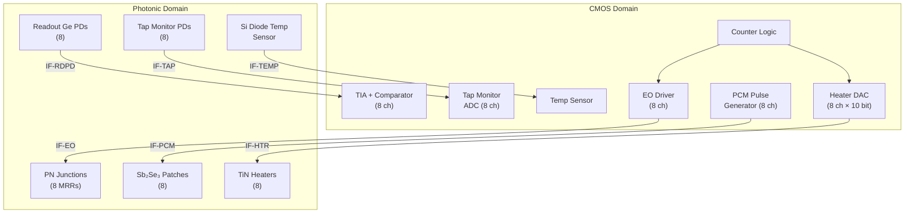
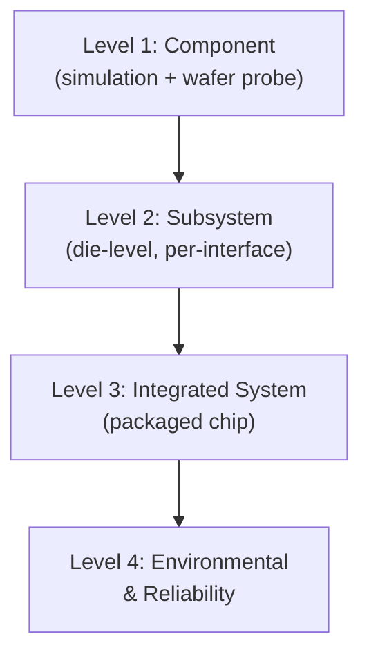
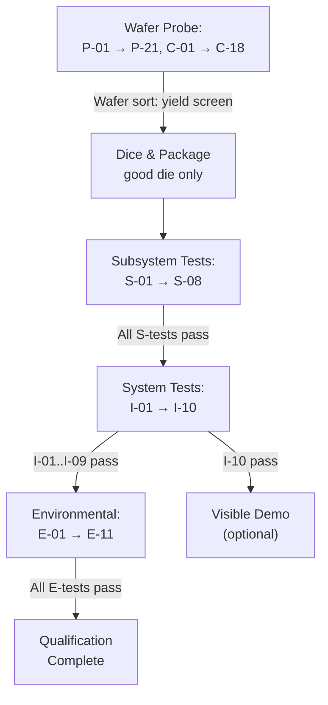

# Photonic-CMOS Interface Specification & Verification Test Plan

Document ID: PCC-IFS-001 Rev A
Parent: Photonic Color-Counter ASIC Architecture (PCC-ARCH-001)

---

## Part I — Photonic-CMOS Interface Specification

### 1. Scope

This specification defines every electrical, optical, and thermal interface between the CMOS control ASIC and the photonic integrated circuit (PIC) layer of the 8-bit photonic color-counter. It applies to the monolithic GF 45SPCLO implementation where both layers share a single die, but the interface boundaries are defined so that the spec is equally valid for a hybrid 2.5D package where the CMOS and PIC are separate chiplets connected by micro-bumps.

### 2. Interface Map



### 3. Interface Definitions

#### 3.1 IF-HTR — Heater Drive Interface (CMOS → PIC)

Controls thermo-optic resonance alignment of each MRR.

| Parameter | Min | Typical | Max | Unit | Notes |
|---|---|---|---|---|---|
| Number of channels | — | 8 | — | — | One per MRR |
| DAC resolution | — | 10 | — | bits | 1024 steps across full tuning range |
| Output type | — | Current sink | — | — | TiN heater is resistive load |
| Heater resistance (with undercut) | 800 | 1000 | 1200 | Ω | Measured at 25°C |
| Max heater current | — | — | 8 | mA | Corresponds to ~64 mW at 1 kΩ |
| Max heater voltage | — | — | 3.3 | V | Limited by CMOS I/O supply |
| Tuning efficiency (with undercut) | 3.5 | 4.3 | 5.5 | mW/π | Process-dependent |
| Full-FSR tuning power | — | 25 | 35 | mW | Worst-case across PVT |
| Step resolution (wavelength) | — | 5.6 | — | pm/LSB | FSR ÷ 2¹⁰ |
| Settling time (10%–90%) | — | 8 | 15 | µs | Thermal time constant of undercut bridge |
| Update rate (locking loop) | — | 100 | — | kHz | PID controller bandwidth |
| Routing | — | Metal 4–5 | — | — | Avoid coupling to RF lines |
| ESD protection | — | HBM 2 kV | — | — | Foundry standard I/O cell |

**Timing diagram (heater update cycle):**
```
CLK_LOCK __|‾‾‾‾‾‾|________|‾‾‾‾‾‾|________
TAP_SAMPLE _______|‾|______________________|‾|__
PID_CALC   __________|‾‾‾|___________________|‾‾‾|
DAC_UPDATE ______________|‾|____________________|‾|
                  <-- 10 µs period -->
```

#### 3.2 IF-EO — Electro-Optic Modulation Interface (CMOS → PIC)

Controls fast bit-level switching of each MRR via PN-depletion junction.

| Parameter | Min | Typical | Max | Unit | Notes |
|---|---|---|---|---|---|
| Number of channels | — | 8 | — | — | One per MRR |
| Junction type | — | Reverse-biased PN depletion | — | — | Z-shape or vertical junction |
| Reverse bias (DC) | −0.5 | −1.0 | −2.0 | V | Set by bias DAC |
| RF swing (V_pp) | 0.5 | 1.0 | 1.5 | V | Differential or single-ended |
| Modulation depth required | 20 | 30 | — | pm | On/off resonance shift for >20 dB extinction |
| Shift efficiency | 20 | 30 | 45 | pm/V | Process-dependent |
| Junction capacitance | — | 25 | 40 | fF | Per MRR at −1 V bias |
| Series resistance | — | 200 | 400 | Ω | Doping-dependent |
| 3 dB EO bandwidth | 20 | 35 | 48 | GHz | RC-limited |
| Switching energy | — | 6 | 15 | fJ/bit | C × V² / 4 |
| Driver output impedance | 40 | 50 | 60 | Ω | Matched to transmission line |
| Rise / fall time (20%–80%) | — | 15 | 25 | ps | At driver output |
| Routing | — | Metal 7–8 (RF) | — | — | Controlled impedance, 50 Ω microstrip |
| Maximum trace length (CMOS → MRR) | — | — | 500 | µm | To limit RC parasitic degradation |

**Signal integrity note:** Because the MRR junction is a capacitive load (not 50 Ω terminated), the driver sees a reflection. At <500 µm trace length, the round-trip delay is <7 ps — well within the bit period at 10 GHz. No transmission-line termination is required for the baseline 10 GHz clock rate. For the 48 GHz extension, a terminated driver topology or a co-located driver cell is needed.

**Timing relationship to counter:**
```
COUNTER CLK  __|‾‾‾‾|____|‾‾‾‾|____|‾‾‾‾|____
BIT_n        XXXX|  0  |  0  |  1  |  1  |XXXX
EO_DRV_n     XXXX| Vlo | Vlo | Vhi | Vhi |XXXX
              <--T_PROP-->|
              (< 50 ps driver propagation delay)
```

Counter-to-EO latency budget: < 100 ps (combinational path from flip-flop Q to driver output).

#### 3.3 IF-RDPD — Readout Photodetector Interface (PIC → CMOS)

Returns the optical state of each wavelength channel to the CMOS readout register.

| Parameter | Min | Typical | Max | Unit | Notes |
|---|---|---|---|---|---|
| Number of channels | — | 8 | — | — | One per demuxed λ |
| Detector type | — | Ge-on-Si vertical PIN | — | — | Foundry standard |
| Responsivity (at 1550 nm) | 0.6 | 0.8 | 1.0 | A/W | Wavelength-dependent |
| Dark current (at −1 V, 25°C) | — | 10 | 100 | nA | Increases with temperature |
| Bandwidth | 40 | 50 | 67 | GHz | Exceeds counter rate |
| Photocurrent (bit = 1, channel present) | 15 | 21 | 30 | µA | From link budget (−15.7 dBm) |
| Photocurrent (bit = 0, channel blocked) | — | <0.1 | 0.5 | µA | MRR extinction >30 dB |
| TIA transimpedance gain | — | 5 | — | kΩ | Converts µA → mV |
| TIA output swing | — | 100 | — | mV_pp | For 21 µA × 5 kΩ |
| Comparator threshold | 30 | 50 | 80 | mV | Set per-channel during calibration |
| Comparator hysteresis | 5 | 10 | — | mV | Prevents chatter |
| Decision latency (PD input → digital bit) | — | 200 | 500 | ps | TIA + comparator delay |
| Readout register capture edge | — | Rising CLK_RD | — | — | Synchronous to system clock |
| Bias voltage (PD cathode) | −1.0 | −1.5 | −2.0 | V | Reverse bias for speed |

**Noise budget:**
- TIA input-referred noise: ~2 µA_rms (integrated to 10 GHz BW)
- Signal (bit=1): 21 µA
- Noise floor (bit=0): 0.1 µA (dark + leakage + crosstalk)
- SNR for bit=1 detection: 21/2 = 10.5 (20.4 dB) → BER < 10⁻¹²
- Minimum detectable signal: 5 µA (comparator threshold + noise margin)
- Link margin: 21 µA / 5 µA = 4.2× (6.2 dB)

#### 3.4 IF-TAP — Tap Monitor Interface (PIC → CMOS)

Provides resonance-state feedback for the wavelength locking loop.

| Parameter | Min | Typical | Max | Unit | Notes |
|---|---|---|---|---|---|
| Number of channels | — | 8 | — | — | One tap PD per MRR drop port |
| Detector type | — | Ge-on-Si PIN (low speed) | — | — | Bandwidth >1 MHz sufficient |
| Photocurrent range | 0.01 | — | 50 | µA | Proportional to dropped optical power |
| ADC type | — | ΔΣ current-input | — | — | 1st-order, 1-bit, 10 MHz clock |
| ADC effective resolution | — | 10 | — | bits | 60 dB SNR in 100 kHz BW |
| ADC input range | 0 | — | 50 | µA | Rail-to-rail |
| Locking error signal | — | I_tap − I_setpoint | — | µA | Signed, drives PID |
| PID output | — | 10-bit DAC code | — | — | Drives IF-HTR |
| Locking loop latency | — | 5 | 10 | µs | ADC + PID + DAC |
| Locking precision (steady-state) | — | ±0.5 | ±2 | pm | Wavelength error at PD |

**Locking algorithm:**
1. At startup, sweep heater DAC across full range, record tap PD current vs. DAC code.
2. Identify resonance dip (minimum through-port power = maximum tap power) for each MRR.
3. Set PID setpoint to the target tap current corresponding to the desired operating point (slightly detuned from peak for modulation linearity).
4. Enable closed-loop PID. Loop rate = 100 kHz.
5. On temperature excursion >±10°C from calibration point, trigger re-sweep.

#### 3.5 IF-PCM — Phase-Change Material Programming Interface (CMOS → PIC)

Non-volatile resonance trimming via forward-biased PN junction pulses that trigger Sb₂Se₃ phase transition.

| Parameter | Min | Typical | Max | Unit | Notes |
|---|---|---|---|---|---|
| Number of channels | — | 8 | — | — | One per MRR |
| Pulse type | — | Forward-bias current pulse through existing PN junction | — | — | No extra pads needed |
| Crystallization pulse (set) | — | — | — | — | |
|   Amplitude | 5 | 8 | 12 | mA | Forward current |
|   Duration | 50 | 100 | 500 | µs | Long pulse, gradual heating |
|   Repetitions | 1 | 10 | 100 | — | Incremental trim |
| Amorphization pulse (reset) | — | — | — | — | |
|   Amplitude | 10 | 15 | 20 | mA | Higher current, rapid quench |
|   Duration | 50 | 100 | 200 | ns | Short pulse |
| Resonance shift per set pulse | 5 | 20 | 50 | pm | Depends on Sb₂Se₃ patch geometry |
| Total trim range | — | Full FSR | — | — | With sufficient pulse count |
| Endurance | 10³ | 10⁴ | — | cycles | Set/reset before degradation |
| Retention (at 85°C) | 10 | — | — | years | Non-volatile |
| Trim direction | — | Bidirectional (red/blue shift) | — | — | Set = red shift; Reset = blue shift |

**Trim procedure:**
1. Disable EO modulation and locking loop.
2. Sweep heater to align MRR to reference laser.
3. Record initial heater DAC code (= fabrication offset).
4. Apply PCM set pulses incrementally, measuring resonance shift after each.
5. Stop when heater DAC code for alignment is near mid-range (maximizing remaining tuning authority).
6. Re-enable locking loop.

#### 3.6 IF-TEMP — Temperature Sensor Interface (PIC → CMOS)

On-die temperature measurement for global thermal compensation.

| Parameter | Min | Typical | Max | Unit | Notes |
|---|---|---|---|---|---|
| Sensor type | — | Si diode (forward-biased) | — | — | Foundry standard |
| Number of sensors | — | 2 | — | — | One near MRR array, one at die edge |
| Sensitivity | — | −1.8 | — | mV/°C | Standard Si bandgap |
| ADC resolution | — | 10 | — | bits | Shared ΔΣ ADC |
| Temperature resolution | — | 0.1 | — | °C | |
| Measurement rate | — | 1 | — | kHz | Slow; for trend monitoring |
| Operating range | −40 | 25 | 105 | °C | Industrial range |

### 4. Power Domains

| Domain | Voltage | Current (typ) | Function |
|---|---|---|---|
| VDD_CORE | 0.9 V | 50 mA | 45 nm CMOS digital logic, counter, PID |
| VDD_IO | 1.8 V | 20 mA | Level shifters, heater DAC drivers |
| VDD_HTR | 3.3 V | 80 mA | TiN heater supply (8 ch × 10 mA max) |
| VDD_TIA | 1.8 V | 10 mA | Analog TIA and comparator |
| VDD_EO | 1.8 V | 5 mA | EO driver swing supply |
| VPD_BIAS | −1.5 V | 1 mA | Ge PD reverse bias (generated on-chip by charge pump or off-chip) |

Total estimated power: < 350 mW including heaters at worst-case tuning.

### 5. Timing Summary

| Path | Latency | Notes |
|---|---|---|
| Counter clock → EO driver output | < 100 ps | Combinational + driver delay |
| EO driver → MRR optical state change | < 25 ps | PN junction RC |
| MRR optical state → PD photocurrent | < 100 ps | Waveguide propagation + PD transit |
| PD → TIA → comparator → readout register | < 500 ps | Analog chain + setup time |
| **Total: clock edge → valid readout** | **< 725 ps** | < 1 counter clock period at 1 GHz |
| Heater locking loop iteration | ~10 µs | Slow loop, background operation |
| PCM trim pulse | 100 ns – 500 µs | Offline calibration only |

At 10 GHz counter clock, the readout path cannot capture the same cycle's output. The architecture uses **pipeline register staging**: readout register captures state N while counter advances to N+1. This adds 1 clock cycle of latency but is standard practice.

### 6. Layout Constraints

| Constraint | Value | Reason |
|---|---|---|
| MRR-to-MRR pitch | ≥ 50 µm | Thermal isolation |
| EO driver to MRR trace length | ≤ 500 µm | Signal integrity at 10 GHz |
| Heater metal routing layer | M4–M5 | Avoid RF crosstalk on M7–M8 |
| RF (EO) routing layer | M7–M8 | Controlled impedance |
| Ground plane | M6 (continuous) | Shields heater and RF layers |
| PD to TIA trace length | ≤ 200 µm | Minimize capacitive loading |
| Tap PD routing | Any lower metal | Low speed, no constraint |
| Keep-out zone around undercut window | ≥ 10 µm from WG edge | Structural integrity |
| Guard ring around PIC region | Standard foundry ring | ESD + latch-up protection |

---

## Part II — Verification Test Plan

### 7. Test Hierarchy



### 8. Level 1 — Component Verification

#### 8.1 Photonic Component Tests (wafer-level, optical probe station)

| ID | Test | Method | Pass Criteria |
|---|---|---|---|
| P-01 | Waveguide propagation loss | Cutback method on test spirals (1, 2, 5, 10 cm lengths) | Si: < 2 dB/cm; SiN: < 0.3 dB/cm |
| P-02 | Edge coupler insertion loss | Fiber-to-fiber through loopback | < 1.5 dB per facet |
| P-03 | MRR resonance wavelength | Broadband sweep (tunable laser + PD) on each of 8 MRRs | Within ±2 nm of design target |
| P-04 | MRR loaded Q factor | Lorentzian fit to resonance dip | Q > 4,000 (for EO operation); Q > 50,000 (for filter MRRs) |
| P-05 | MRR free spectral range | Measure adjacent resonances | 5.5–6.0 nm (±5% of 5.7 nm target) |
| P-06 | MRR extinction ratio (drop port) | Through-port power at resonance vs. off-resonance | > 25 dB |
| P-07 | MRR through-port insertion loss | Off-resonance through-port power vs. bypass reference | < 0.5 dB |
| P-08 | WDM demux channel isolation | Inject single λ, measure power at all 8 outputs | Adjacent ch: < −25 dB; non-adjacent: < −35 dB |
| P-09 | WDM demux insertion loss | Per-channel through loss | < 2.0 dB |
| P-10 | Ge PD responsivity | Known optical power at 1550 nm, measure photocurrent | 0.6–1.0 A/W |
| P-11 | Ge PD dark current | No illumination, sweep bias −0.5 to −2 V at 25°C and 85°C | < 100 nA at 25°C; < 500 nA at 85°C |
| P-12 | Ge PD bandwidth | Small-signal S21 with VNA-modulated laser | > 40 GHz at −1.5 V bias |
| P-13 | Heater resistance | 4-point probe per heater | 800–1200 Ω |
| P-14 | Heater tuning efficiency | Sweep heater power, track resonance shift | 3.5–5.5 mW/π (with undercut) |
| P-15 | Heater thermal time constant | Step response (optical resonance tracking) | < 15 µs (10%–90%) |
| P-16 | Thermal crosstalk coefficient | Heat MRR_i, measure resonance shift at MRR_j | < 1% of self-shift at 50 µm pitch |
| P-17 | PN junction I-V characteristic | Voltage sweep −3 V to +1 V per MRR junction | Reverse leakage < 10 nA at −1 V |
| P-18 | PN junction capacitance | C-V sweep at 1 MHz | 20–40 fF at −1 V |
| P-19 | EO resonance shift efficiency | DC bias sweep, track resonance on OSA | > 20 pm/V |
| P-20 | EO S21 bandwidth | VNA + modulated CW laser | > 20 GHz at −1 V bias |
| P-21 | Comb source output spectrum (if on-chip) | OSA with lensed fiber | ≥ 8 lines within 3 dB flatness across 800 GHz |

#### 8.2 CMOS Component Tests (wafer-level, electrical probe)

| ID | Test | Method | Pass Criteria |
|---|---|---|---|
| C-01 | Counter functionality | JTAG/scan chain: apply clock sequence, read state | Correct 8-bit binary count, 0–255, wrap |
| C-02 | Counter max frequency | Increase clock until first error in scan | ≥ 10 GHz |
| C-03 | Heater DAC INL/DNL | Ramp DAC code 0–1023, measure output current with SMU | INL < ±1 LSB; DNL < ±0.5 LSB |
| C-04 | Heater DAC output range | Code 0 and 1023 | 0–8 mA (±5%) |
| C-05 | Heater DAC settling time | Step from code 0 to 512, capture on oscilloscope | < 1 µs (electrical settling; thermal follows) |
| C-06 | EO driver output swing | Measure V_pp on 50 Ω load | 0.5–1.5 V_pp programmable |
| C-07 | EO driver rise/fall time | Eye diagram at 10 Gbps PRBS7 | < 25 ps (20–80%) |
| C-08 | EO driver propagation delay | Clock-to-output time on scope | < 80 ps |
| C-09 | TIA transimpedance gain | Inject known current (PD emulator), measure output voltage | 4–6 kΩ (±20%) |
| C-10 | TIA bandwidth | Frequency sweep with calibrated current source | > 10 GHz (−3 dB) |
| C-11 | TIA input-referred noise | No input, measure output noise spectral density, integrate | < 3 µA_rms (0.01–10 GHz) |
| C-12 | Comparator offset | Sweep threshold DAC with fixed TIA output, find toggle point | Offset < ±5 mV from programmed threshold |
| C-13 | Comparator hysteresis | Ramp up and ramp down, measure gap | 5–15 mV |
| C-14 | Tap ADC SNR | Apply 50 kHz sinusoidal current (10 µA_pp), measure SNDR | > 55 dB (>9 ENOB) |
| C-15 | PID controller step response | Simulate in RTL; on-chip: inject step disturbance via heater bias | Settling < 100 µs; overshoot < 10% |
| C-16 | PCM pulse generator waveform | Capture on oscilloscope (via test pad) | Amplitude ±10%; duration ±20% of programmed |
| C-17 | Temperature sensor accuracy | Compare with external thermocouple at 0, 25, 50, 85°C | ±1°C |
| C-18 | Power supply current (per domain) | Measure at supply pins during idle and active modes | Within ±15% of design estimate |

### 9. Level 2 — Subsystem Integration Tests

These tests verify each CMOS-to-PIC interface end-to-end on a single die.

| ID | Test | Setup | Pass Criteria |
|---|---|---|---|
| S-01 | Heater loop: DAC → heater → resonance shift | Sweep DAC code via register write; external tunable laser + power meter on through port | Monotonic resonance shift; full FSR coverage; P_π within spec |
| S-02 | EO switching: driver → MRR → PD | Drive one channel with 10 Gbps PRBS7 from on-chip pattern generator; capture eye on readout PD with high-speed scope | Open eye; extinction ratio > 6 dB; jitter < 15 ps_rms |
| S-03 | Readout chain: PD → TIA → comparator → register | Inject known optical power into one channel (external laser); read register bit | Bit toggles correctly; threshold calibratable |
| S-04 | Tap locking loop: tap PD → ADC → PID → heater DAC | Enable locking on one channel; apply ±5°C thermal perturbation via TEC; monitor resonance on OSA | Resonance tracks within ±2 pm of setpoint |
| S-05 | Multi-channel crosstalk: 8 channels simultaneously | Lock all 8 MRRs; toggle one channel at 1 GHz; monitor adjacent channels on scope | Crosstalk-induced bit errors = 0 over 10¹⁰ transitions |
| S-06 | PCM trim: pulse → resonance shift | Apply 10 incremental set pulses; measure resonance after each | Monotonic shift; total > 200 pm; retention > 24 hours at room temp |
| S-07 | Static state encoding: all 256 states | Program counter to each value 0–255 via scan chain; capture optical spectrum on OSA | Correct λ-presence pattern for every state; channel isolation > 25 dB |
| S-08 | Power measurement | Measure all supply currents during S-07 | Total < 350 mW |

### 10. Level 3 — Integrated System Tests

Performed on packaged chip with fiber attach, TEC-controlled stage, and external comb or laser source.

| ID | Test | Procedure | Pass Criteria |
|---|---|---|---|
| I-01 | Free-running count | Apply external clock at 1 GHz; let counter run; capture readout register via host FPGA at every cycle for 10⁶ cycles | Zero readout errors; correct binary sequence 0→255→0… |
| I-02 | Maximum count rate | Increase clock from 1 GHz in 1 GHz steps; repeat I-01 at each step | Identify max clock with BER < 10⁻⁹ on all 8 channels |
| I-03 | Wavelength-state spectral verification | At each count value, capture output spectrum via OSA (integration mode) | All 256 spectral signatures match expected bit patterns |
| I-04 | Optical readback fidelity | Run counter at 1 GHz; simultaneously capture register output (electrical) and readout register (optical-to-electrical); compare bit-by-bit over 10⁸ transitions | Mismatch rate < 10⁻⁹ |
| I-05 | Startup sequence | Power cycle; verify locking loop acquires lock on all 8 channels | Lock acquired within 5 ms on all channels; no spurious count output during lock acquisition |
| I-06 | Comb source coupling | Measure per-channel power at MRR input bus with all MRRs off-resonance | Per-channel power within ±2 dB of −10 dBm target; channel-to-channel flatness < 3 dB |
| I-07 | End-to-end latency | Trigger counter increment; measure delay to valid optical state on high-speed PD | < 1.5 ns (counter + EO driver + optical propagation) |
| I-08 | Reset and preset | Assert synchronous reset; verify all-zero state; load preset value via scan; verify correct optical pattern | Correct state within 2 clock cycles |
| I-09 | External readout output | Connect output fiber to external WDM demux + PD array; compare with on-chip readout | Bit-for-bit match across all 256 states |
| I-10 | Visible output (if equipped) | Collect output from visible conversion section with spectrometer; photograph with CMOS camera | Distinguishable spectral lines; visible color pattern changes with count |

### 11. Level 4 — Environmental and Reliability Tests

| ID | Test | Condition | Pass Criteria |
|---|---|---|---|
| E-01 | Temperature sweep (functional) | TEC ramp −10°C to +85°C in 5°C steps; run I-01 at each setpoint | Zero errors at all temperatures; locking loop maintains lock |
| E-02 | Thermal shock | Rapid transition 0°C → 85°C → 0°C, 50 cycles (per JEDEC JESD22-A104) | No permanent degradation; locking reacquires within 10 ms |
| E-03 | Thermal cycling (heater endurance) | Full-range heater DAC sweep at 100 kHz for 10⁹ cycles (≈3 hours) | Heater resistance drift < 5%; tuning efficiency drift < 10% |
| E-04 | EO junction reliability | DC bias at −2 V, 85°C, 1000 hours | Reverse leakage increase < 2× |
| E-05 | PD degradation | −1.5 V bias, 85°C, 1000 hours | Responsivity decrease < 5%; dark current increase < 3× |
| E-06 | PCM retention | Trim all 8 channels; bake at 85°C for 168 hours; remeasure resonance | Drift < ±10 pm |
| E-07 | PCM endurance | Set/reset cycle each channel 10⁴ times | Resonance shift per pulse stable within ±20% |
| E-08 | Humidity (if non-hermetic package) | 85°C / 85% RH, 168 hours, powered (JEDEC JESD22-A101) | No functional failure; optical loss increase < 1 dB |
| E-09 | ESD (chip level) | HBM ±2 kV all pins; CDM ±500 V | No functional failure |
| E-10 | Latch-up | ±100 mA injection per JEDEC JESD78 | No latch-up trigger at I/O or supply pins |
| E-11 | Vibration and mechanical shock | Random vibration per MIL-STD-883 Method 2026; shock 1500 G | No fiber detachment; no functional failure |

### 12. Test Infrastructure Requirements

| Equipment | Function | Key Specification |
|---|---|---|
| Tunable CW laser (C-band) | Wavelength sweep for MRR characterization | Range 1520–1580 nm; linewidth < 100 kHz; power > 10 dBm |
| Optical spectrum analyzer (OSA) | Spectral measurement of comb and output | Resolution < 0.01 nm; dynamic range > 60 dB |
| High-speed real-time oscilloscope | Eye diagrams, timing | BW > 50 GHz; sample rate > 100 GSa/s |
| Bit-error-rate tester (BERT) | PRBS pattern and error counting for I-04 | > 10 Gbps; PRBS 7/15/31 |
| Source measurement unit (SMU) | I-V, C-V characterization; DAC verification | 4-quadrant; fA resolution |
| TEC-controlled probe station | Wafer-level temperature control | −40°C to +125°C; ±0.1°C stability |
| Fiber array alignment stage | Edge-coupled fiber attach during test | 6-axis piezo; <0.1 µm resolution |
| FPGA host board | Register read/write, clock generation, BERT comparison | > 200 I/O; clock to 12 GHz |
| Environmental chamber | Temperature/humidity cycling | −40°C to +150°C; 10–95% RH |
| VNA (vector network analyzer) | S21 EO bandwidth, PD bandwidth | DC to 67 GHz |
| Power meter (calibrated) | Absolute optical power measurements | Range −60 to +10 dBm; ±0.1 dB accuracy |
| Spectrometer (visible) | Visible-band harmonic measurement | Range 350–750 nm; resolution < 0.5 nm |

### 13. Test Sequence and Dependencies



**Wafer sort yield screen criteria (minimum to package):**
- P-01, P-06, P-10, P-13, P-14, P-18 within spec
- C-01 (counter functional), C-03 (DAC linearity), C-09 (TIA gain) within spec
- At least 7 of 8 channels functional (1 channel redundancy permitted)

### 14. Traceability Matrix

| Architecture Requirement | Interface Spec Section | Test IDs |
|---|---|---|
| 8-bit binary counting at ≥10 GHz | IF-EO (§3.2), Timing (§5) | C-01, C-02, I-01, I-02 |
| Wavelength-encoded state output | IF-EO (§3.2), IF-RDPD (§3.3) | P-03–P-07, S-02, S-07, I-03 |
| Channel isolation >25 dB | IF-RDPD noise budget (§3.3) | P-06, P-08, S-05 |
| Closed-loop resonance locking | IF-TAP (§3.4), IF-HTR (§3.1) | S-04, E-01, I-05 |
| Non-volatile fabrication trim | IF-PCM (§3.5) | S-06, E-06, E-07 |
| Operation −10°C to +85°C | IF-TEMP (§3.6), thermal budget (§7) | E-01, E-02 |
| Total power < 350 mW | Power domains (§4) | S-08, C-18 |
| Readout BER < 10⁻⁹ | IF-RDPD noise budget (§3.3) | I-04 |
| Visible output (optional) | Color-to-bit mapping (arch §4.3) | I-10 |
| Startup in < 5 ms | Locking loop (§3.4) | I-05 |
