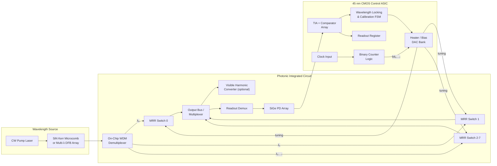

# Photonic Waveguide Color-Counting ASIC — Complete Architecture

## 1. Executive Summary

This document describes a hybrid electro-photonic ASIC that **encodes binary counter state as the presence or absence of distinct optical wavelength channels** — a "color pattern." A Kerr frequency comb or multi-wavelength laser generates N spectrally distinct carriers; a bank of microring resonator (MRR) switches, controlled by CMOS counter logic, selectively passes or blocks each wavelength to express the current count value. Optional nonlinear harmonic conversion extends the output into the visible spectrum, making the count state directly observable as a pattern of colored light.

The architecture is staged: the first implementation uses CMOS for reliable counting and closed-loop thermal control, with photonics providing wavelength-parallel state encoding and readout. Later stages migrate toggle logic into optical MRR switching networks as optical memory and cascadability mature.

---

## 2. System Block Diagram



---

## 3. Material Platform and Fabrication

### 3.1 Target Process: GF Fotonix 45SPCLO (or equivalent 300 mm CMOS-photonics)

| Layer | Material / Thickness | Function |
|---|---|---|
| Waveguide core (active) | Crystalline Si, 220 nm on SOI | MRR modulators, switches, PN-junction phase shifters |
| Waveguide core (passive) | PECVD Si₃N₄, 200–400 nm | Low-loss routing, comb source resonator (if Q permits), visible transparency |
| Buried oxide | SiO₂, ~2 µm | Optical isolation from substrate |
| Cladding | SiO₂ (PECVD) or air-clad for dispersion engineering | Mode confinement, dispersion control |
| Heaters | TiN resistive layer in BEOL | Thermo-optic tuning of MRR resonances |
| Photodetectors | Epitaxial Ge on Si | High-speed C/O-band detection (responsivity ~0.8 A/W, BW >50 GHz) |
| Electronics | 45 nm SOI CMOS, 9 metal levels | Counter logic, DACs, TIAs, control FSMs |
| Edge coupler | Multi-tip SiN inverse taper | Low-loss fiber attach (0.7–1.4 dB demonstrated) |

**Key process features exploited:**
- Partial etch step for rib/ridge waveguide MRR designs
- Multiple doping implant levels for vertical and Z-shape PN junctions
- Far-BEOL V-groove for passive fiber alignment
- Foundry-compatible thermal undercut option (5× heater efficiency improvement demonstrated at AIM Photonics, 2025)

### 3.2 Comb Source Integration Strategy

Two options ranked by practicality:

1. **Flip-chip bonded SiN comb chip** — A separate ultra-high-Q (>10⁸) SiN microresonator die, fabricated in a dedicated low-loss SiN process (e.g., Ligentec AN800), is bump-bonded to the ASIC. A heterogeneously integrated DFB laser pumps the comb. This decouples comb Q from CMOS thermal budget.
2. **On-chip SiN comb** — If the foundry SiN layer achieves Q > 10⁶ (demonstrated in GF 45CLO SiN), a moderate-power (~100 mW) external pump can generate a comb directly. Lower Q limits comb line count and coherence.

For an 8-bit counter only 8 comb lines are needed — well within reach of either approach.

---

## 4. Wavelength Source and Color Generation

### 4.1 Near-Infrared Comb

- **Resonator:** SiN racetrack, R ≈ 100–150 µm, FSR = 100 GHz (0.8 nm at 1550 nm)
- **Pump:** Self-injection-locked DFB at ~1550 nm, on-chip power ~50–130 mW
- **Soliton state:** Dissipative Kerr soliton or dark pulse, producing 8–128 low-noise comb lines across C-band
- **Channel grid:** 100 GHz spacing, ITU-compatible, directly usable with commercial WDM components

### 4.2 Visible Extension (optional demonstration path)

Leveraging the same SiN resonator or a dedicated multimode SiN waveguide section:

- **Third-harmonic generation (THG):** IR comb at ~1560 nm → green at ~520 nm via χ(3) modal phase matching. 30 visible comb lines demonstrated (Columbia, 2016).
- **Sum-frequency generation (SFG):** Cascaded three-photon mixing transfers comb structure to 400–600 nm (blue–orange). Demonstrated spanning violet to red from a single IR pump in an adiabatic multimode SiN microresonator (Columbia/OSTI, 2025).
- **All-optical poling (AOP):** Photo-induced χ(2) in SiN enables efficient SHG at ~515–540 nm with up to 3.5 mW green power and 29 nm tunability (2026 results).

Each visible line inherits the comb's equidistant spacing. The count state becomes a directly observable pattern of colored spots.

### 4.3 Color-to-Bit Mapping

| Bit | IR Channel (C-band) | Visible Harmonic (approx.) |
|---|---|---|
| 0 (LSB) | λ₀ = 1549.32 nm | ~516 nm (green) |
| 1 | λ₁ = 1550.12 nm | ~517 nm |
| 2 | λ₂ = 1550.92 nm | ~517 nm |
| 3 | λ₃ = 1551.72 nm | ~518 nm |
| 4 | λ₄ = 1552.52 nm | ~518 nm |
| 5 | λ₅ = 1553.32 nm | ~518 nm |
| 6 | λ₆ = 1554.13 nm | ~518 nm |
| 7 (MSB) | λ₇ = 1554.94 nm | ~518 nm |

(Visible separation is very small via THG of adjacent C-band lines. For wider visible color spread, use harmonics of a wider-FSR comb pumped at different bands, or use dispersive-wave engineering to span 780–1550 nm before THG/SFG, producing visible channels from blue to red.)

---

## 5. Photonic Datapath — MRR Switch Bank

### 5.1 Individual Channel Switch

Each bit i is controlled by one add-drop MRR tuned to resonate at λᵢ:

- **On-resonance (bit = 0):** Light at λᵢ drops into the ring and is routed to a dump port or absorbed. The channel is absent from the output bus.
- **Off-resonance (bit = 1):** Light at λᵢ passes through the bus waveguide to the output. The channel is present.

Resonance is shifted by the thermo-optic or electro-optic effect:

| Tuning mechanism | Shift range | Speed | Power |
|---|---|---|---|
| TiN micro-heater (thermo-optic) | Full FSR (~5–8 nm) | ~1 µs | 4.3–25 mW/π (with/without undercut) |
| PN depletion junction (electro-optic) | ~30 pm/V | ~20 ps (48 GHz BW) | ~6 fJ/bit |
| MOSCAP junction (electro-optic) | ~90 GHz (0.72 nm) with 4 V | ~5 GHz | ~10 fJ/bit |
| Phase-change material Sb₂Se₃ trim | Full FSR (non-volatile) | ~100 ns set | 0 static (non-volatile) |

**Recommended hybrid approach:** Use thermo-optic tuning for initial resonance alignment (compensating fabrication variation), and PN-depletion or MOSCAP electro-optic modulation for fast bit-toggling at the counter clock rate.

### 5.2 MRR Array Layout

8 MRRs with radii lithographically offset to distribute resonances across one FSR:

```
R₀ = 12.000 µm  →  λ₀
R₁ = 12.004 µm  →  λ₁  (ΔR ~ 4 nm per 100 GHz channel spacing)
R₂ = 12.008 µm  →  λ₂
...
R₇ = 12.028 µm  →  λ₇
```

All MRRs coupled to a common bus waveguide. FSR ≈ 5.7 nm at 12 µm radius. 8 channels × 100 GHz = 800 GHz < 1 THz FSR → fits within one FSR with margin.

### 5.3 Channel Isolation

Demonstrated MRR drop-port extinction: >25–33 dB at critical coupling. Adjacent-channel crosstalk is negligible when linewidth (< 0.1 nm loaded) << channel spacing (0.8 nm).

---

## 6. CMOS Control Layer

### 6.1 Digital Counter Core

Standard synchronous binary counter (8 T-flip-flops) in 45 nm CMOS. At 10 GHz clock, the logic dissipates < 1 mW. Counter output bits drive the MRR switch bank through level-shifting DACs.

### 6.2 Wavelength Locking — Thermal Control Unit (TCU)

Per-channel closed-loop controller based on demonstrated radiation-tolerant TCU architectures (CERN/JINST, 2026):

```
 Tap PD → ΔΣ ADC (60 dB SNR) → Digital PID → ΔΣ DAC → Heater driver (≤80 mW)
```

- 4 independent channels per TCU instance; 2 TCU blocks for 8 channels.
- Locking bandwidth: ~100 kHz (sufficient to track package-level thermal transients).
- Power: 1.2 pJ/bit EIC + 0.3 pJ/bit heater at 45 Gbps demonstrated (OFC 2025).

### 6.3 Chip-in-the-Loop Calibration (ChiL)

Adopt the ChiL optimization method (CUHK, 2024) for initial ring alignment: characterize one MRR's tuning curve, then apply the extracted model (tuning efficiency, slope range) to all 8 MRRs through gradient-based on-chip optimization. This reduces calibration from O(k^N) measurements to a single-shot characterization, achieving >9-bit precision even under ±2°C drift and thermal crosstalk.

### 6.4 Readout Path

8 SiGe photodiodes (one per demuxed channel) → 8 TIAs → 8 comparators → 8-bit readout register. The comparator threshold is set per-channel during calibration to account for power variation across comb lines.

---

## 7. Thermal Management

### 7.1 Thermal Undercut

Selective substrate removal beneath MRR heaters provides 5–40× improvement in heater efficiency (AIM Photonics, 2025). For MRRs: P_π drops from ~25 mW to ~4.3 mW. For MZI phase shifters: P_π drops from ~40 mW to ~1 mW.

Undercut is defined by oxide-window openings lithographically placed around each MRR. The isotropic Si substrate etch is self-limiting and produces uniform results across full 300 mm wafers (64 reticles measured with high uniformity).

### 7.2 Thermal Crosstalk Mitigation

- **Physical isolation trenches** between adjacent MRRs (>50 µm pitch demonstrated to reduce crosstalk to <1% of self-heating).
- **ChiL feedback** absorbs residual crosstalk in the digital control loop — no explicit crosstalk calibration needed.
- **Non-volatile trimming** (Sb₂Se₃ phase-change patches on MRR PN junctions) compensates fabrication offset without static heater power, reducing baseline thermal load.

### 7.3 Package Thermal Envelope

Target: ΔT_ambient < ±20°C (typical co-packaged optics range). Heater tuning range must cover at least ±20°C × 0.08 nm/°C (Si thermo-optic) = ±1.6 nm per ring. With undercut heaters at 4.3 mW/π and FSR = 5.7 nm, full-FSR tuning costs ~25 mW per ring worst case. 8 rings → 200 mW thermal budget for wavelength locking (acceptable in a CMOS-photonic ASIC).

---

## 8. Optical Link Budget (per channel, worst case)

| Element | Loss / Gain |
|---|---|
| Comb line power (per line, into bus) | −10 dBm (typical soliton comb) |
| Fiber-to-chip coupling (edge coupler) | −1.4 dB |
| WDM demux insertion loss | −1.5 dB |
| MRR switch pass-through (off-resonance) | −0.5 dB |
| Waveguide routing (2 cm @ 0.14 dB/cm) | −0.3 dB |
| WDM readout demux | −1.5 dB |
| Detector coupling | −0.5 dB |
| **Total at PD** | **≈ −15.7 dBm** |
| SiGe PD responsivity (0.8 A/W) | → ~21 µA photocurrent |
| TIA sensitivity (10 µA threshold) | **Margin: ~3 dB** |

Margin is adequate for binary presence/absence detection. Not suitable for analog amplitude encoding without amplification.

---

## 9. Performance Summary

| Parameter | Value | Source / Basis |
|---|---|---|
| Counter width | 8 bits (scalable to 32+) | Comb line count |
| Max clock rate (E/O switching) | 10 GHz (thermo) / 48 GHz (EO) | MRR switch bandwidth |
| Wavelength channels | 8 × 100 GHz grid | Single-FSR MRR bank |
| Channel isolation | >30 dB | MRR critical coupling |
| Readout energy | <0.38 pJ/bit | Monolithic WDM Rx (UPenn 2025) |
| Heater power (with undercut) | ~4.3 mW/π per ring | AIM Photonics 2025 |
| Total thermal budget (8-ch locking) | <200 mW worst case | Analysis above |
| CMOS logic power | <1 mW | 45 nm counter at 10 GHz |
| Photonic die area (8-ch core) | ~2 × 1 mm² | 8 MRRs + routing |
| Visible output (optional) | 400–700 nm (violet–red) | SiN THG/SFG/AOP |

---

## 10. Risk Register and Mitigations

| Risk | Severity | Mitigation |
|---|---|---|
| Comb source Q insufficient in CMOS SiN | High | Flip-chip bonded dedicated SiN die; or use discrete multi-λ DFB laser array |
| MRR fabrication variation exceeds heater range | Medium | Non-volatile Sb₂Se₃ trimming + ChiL calibration |
| Thermal crosstalk degrades channel isolation | Medium | Physical isolation trenches + ChiL closed-loop |
| Optical loss accumulation limits scalability >8 bits | Medium | On-chip SOA (heterogeneous III-V) for >16-bit designs |
| Visible conversion efficiency too low for observation | Low | Use sensitive camera/spectrometer readout; or stay IR-only |
| All-optical flip-flop memory immature | High | Defer optical counting logic to Phase 7 research; use CMOS counter |

---

## 11. Staged Implementation Roadmap

See the companion Implementation Plan artifact for detailed phases. Summary:

1. **Phase 0–1** (6 mo): Requirements freeze, foundry access, PDK setup
2. **Phase 2–3** (12 mo): Photonic + CMOS subsystem design
3. **Phase 4** (6 mo): Co-simulation, layout, DRC/LVS
4. **Phase 5** (6 mo): Tapeout, fabrication, packaging
5. **Phase 6** (6 mo): Bring-up, validation, demo
6. **Phase 7** (ongoing): Scale to 32-bit, optical-logic experiments, visible-band demo

Total estimated time to first silicon: ~30 months from project start.

---

## 12. Key References

1. GF 45CLO / Fotonix platform — Rakowski et al., OFC 2020; Bian et al., CLEO 2024
2. 1.024 Tb/s monolithic WDM receiver — Pirmoradi et al., UPenn 2025
3. On-chip violet-to-red generation — Corato-Zanarella et al., Optics Express 2025
4. MRR all-optical logic gates — Sethi & Roy, Applied Optics 2014; Liu et al., Micromachines 2025
5. Chip-in-the-loop MRR programming — Liu et al., arXiv:2410.22064, 2024
6. Thermal undercut at 300 mm scale — AIM Photonics, Scientific Reports 2025
7. Wavelength locking TCU — Atzeni et al., JINST 2026
8. Phase-change MRR trimming — Yuan et al., PhotoniX 2025
9. Near-visible soliton microcombs — Nature Communications 2025
10. All-optical CPU on PIC — Kissner et al., Akhetonics 2024
